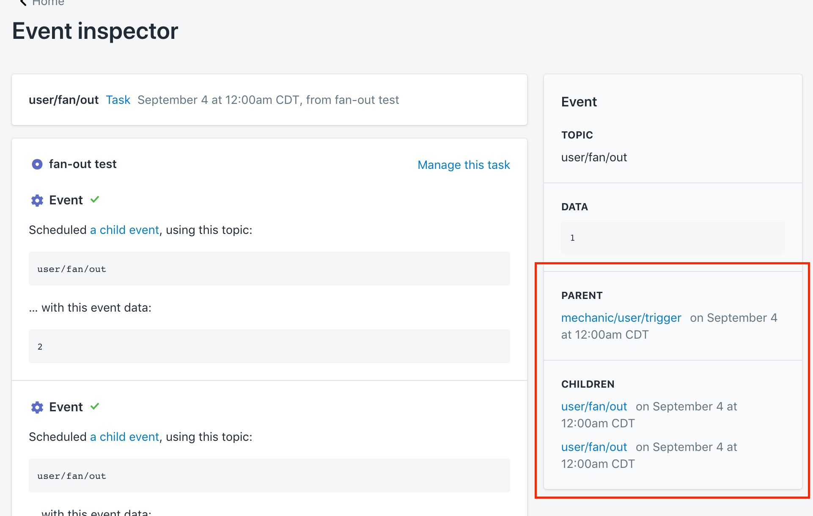

# Parent and child events

In specific cases, events may be triggered by activity associated with an earlier event. In these scenarios, we describe the subsequent event as a **child event**, and the preceding event as a **parent event**.

* The [Event action](../actions/action-types/event.md) generates a new child event, when performed
* A subscription to the [mechanic/actions/perform](../../platform/events/topics/mechanic.md#actions) topic generates new child events as actions are performed

Tasks responding to child events may reference to the parent's event using `{{ event.parent }}`. Parent events are recursively available \(as in `{{ event.parent.parent.parent }}`\), to a limit of 5 generations back.

When viewing any given event in Mechanic, look in the event details to find any parent or child relationships that apply:



Under "Parent" or "Children", click on a linked event topic to open up a specific event.

## Example



```text
mechanic/user/trigger
user/fan/out
```



```text



  
    
      {
        "topic": "user/fan/out",
        "data": {{ n | plus: 1 | json }},
        "task_id": {{ task.id | json }}
      }
    
  

  

```



As written, this task will "fan out": it will generate 1 child event, which will then generate 2 child events, each of which will then generate 3 child events, and each of those will then generate 4 child events, and finally, each of those events will generate 5 child events of their own. The result: 154 events, created with a single click. 💪

Importantly, note the `"task_id"` option, applied to the Event action. This option ensures that only this task, and no other, will respond to the new event. While it's unlikely that any other task will subscribe to "user/fan/out" events, this option is important for ensuring expected behavior.

