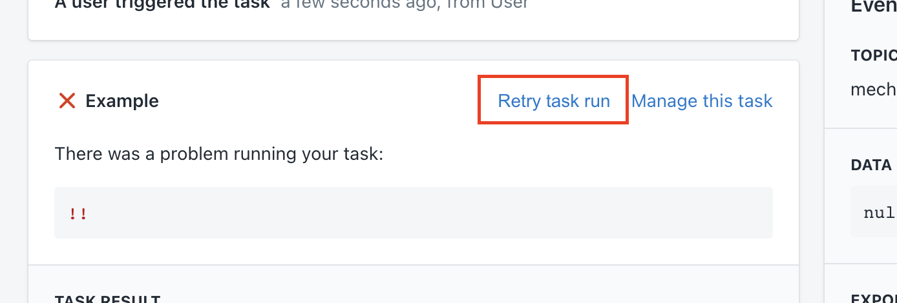

# Retries

In some cases, a run that has already been performed may be performed again, using a **retry**.

When a run is retried, its previous result is permanently discarded. Because of this, runs that already have a meaningful result \(i.e. an event run that gave rise to task runs, or a task run that generated actions, or an action run that succeeded\) cannot be retried.

Runs are given **automatic retries** when a non-permanent error is encountered. In some cases, Mechanic permits **manual retries** for runs, allowing users to reset a run's results and perform the run again.

## Retry context

Retried event runs will always reflect Mechanic's current configuration, including any [event filters](../../platform/events/filters.md).

Retried task runs will always use a task's latest configuration, including the task's [options](../tasks/options/), [code](../tasks/code/), and [Shopify API version](../tasks/shopify-api-version.md).

Retried action runs will use their original action options, as dictated by the task run that generated them. Action runs are entirely unaffected by updates to their task.

## Automatic retries

When non-permanent errors are encountered, Mechanic will automatically retry a run. For [HTTP actions](../actions/http.md), this might be a connection error. For [Email actions](../actions/email.md), this might be a temporary outage with our email provider.

Mechanic will automatically retry these runs up to 4 times, for a total of 5 attempts. Retries are subject to a variable backoff delay, of approximately 0:30, 1:16, 2:32, and 5:08 respectively, for each of the 4 retries.

## Manual retries

Some task runs may be manually retried, via the Mechanic user interface.

### Task runs

Task runs may be retried...

* ... if the task run itself failed \(due to a Liquid error, an API error while reading data, or something else\)
* ... or, if the task run did not generate any actions

During task development, it can be useful to set up a task to only render [log objects](../tasks/code/log-objects.md). A task run which only rendered log objects can be retried, and this ability to retry can be convenient when rapidly iterating on task code.

### Action runs

Only failed action runs may be retried.

