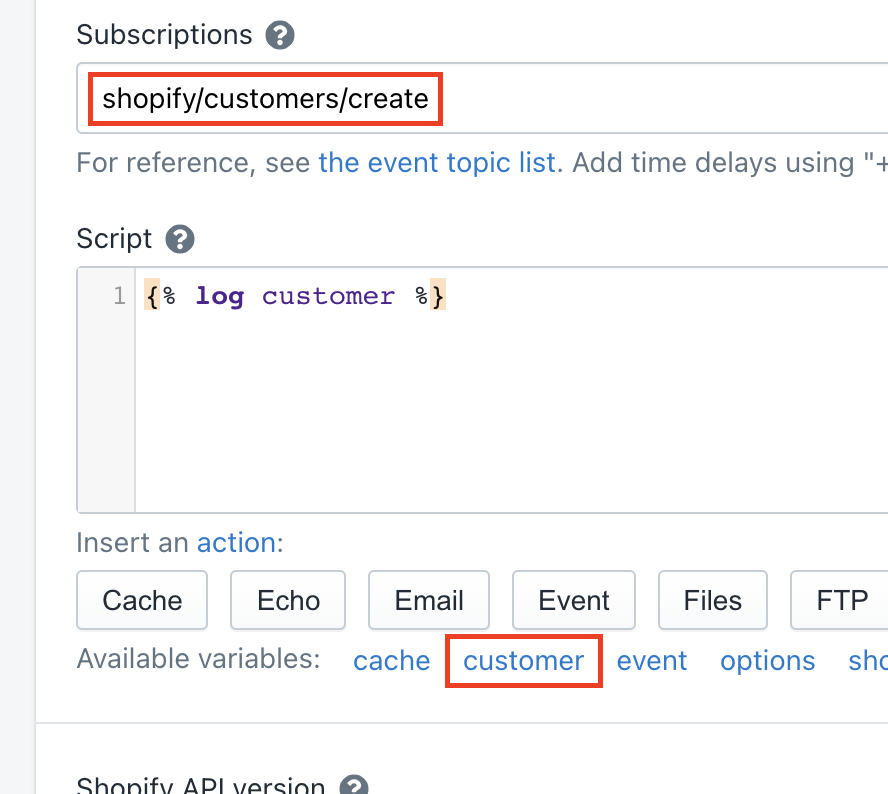

# Environment variables

A task's Liquid code always has access to a set of **environment variables**, defined by Mechanic.


Environment variables may be overwritten as needed. \(When preparing a task preview, this may be a necessary technique.\) To learn more, see [Stub data](../previews/stub-data.md).


| Variable | Contents |
| :--- | :--- |
| `{{ shop }}` | An object containing [Shopify's REST representation of the current Shopify store](https://shopify.dev/docs/admin-api/rest/reference/store-properties/shop) |
| `{{ event }}` | An object containing information about the current event |
| `{{ cache }}` | The current store's Mechanic cache, supporting lookups for cached values |
| `{{ task }}` | An object containing information about the current task |
| `{{ options }}` | An object containing task [**options**](../options/), configured by the user |

## Event subject variables

When a task is actually invoked for an event, it may have access to an additional variable, determined by the specific event it is responding to. When this is the case, the additional variable will be named after the event subject, and its contents will be established by the event's data. The name of this variable is communicated by the Mechanic task editor, based on the task's current [**subscriptions**](../subscriptions.md).

## Shopify variables

All Shopify events support an additional variable named after the event topic. For example, when a task responds to a shopify/customers/create event, it will have access to an additional variable named `{{ customer }}`, containing the customer data contained in the event.

Shopify events always contain data from Shopify's REST representation of each resource; therefore, automatic Shopify variables always contain data from the REST representation as well. The best resource for the data available for each variable type is [Shopify's REST Admin API reference](https://shopify.dev/docs/admin-api/rest/reference).


**Shopify variables in Mechanic do not necessarily contain the same attributes as Liquid variables used in Shopify \(in places like themes or email templates\) – even if they share the same name.**

In Mechanic, Shopify variables always contain data from Shopify events, which are delivered to Mechanic via webhook. This means that Shopify variables always have the same data structure as Shopify webhooks, corresponding to Shopify's REST representation for this data.

For example, while Shopify themes support `{{ customer.name }}`, Mechanic does not \(because [Shopify's REST representation of the customer resource](https://shopify.dev/docs/admin-api/rest/reference/customers/customer) does not contain a "name" property\). On the other hand, Mechanic supports `{{ customer.created_at }}`, while Shopify themes do not.


