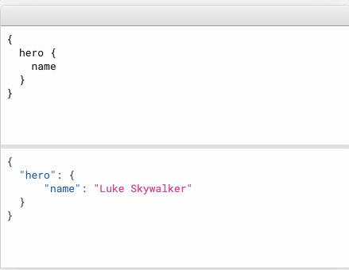

# Basics

GraphQL is a query language used to query APIs and a runtime for fulfilling those queries.  You'll use [queries](queries.md) and [mutations](mutations.md) written in GraphQL to query a GraphQL server, in this case, Shopify and responses will come back in JSON format. GraphQL is the future of Shopify APIs and Shopify has said: "You should expect that there absolutely will be more features that will be only on GraphQL in the future".


This section summarizes Shopify's documentation: [GraphQL and its benefits](https://shopify.dev/concepts/graphql/benefits), [https://graphql.org/](https://graphql.org/), and [https://www.howtographql.com/basics/1-graphql-is-the-better-rest/](https://www.howtographql.com/basics/1-graphql-is-the-better-rest/) visit to get more in-depth information.


### Ask for what you need, receive only what you need

In REST, we get all the attributes associated with a resource, when we may only need a field or two from a resource. This extra data can add up, particularly if we are getting many records in our resultset. In the example below, you can see the difference in JSON response based on the fields we ask for in the GraphQL query.

### Get multiple resources in a single HTTP request

There are many times where we want more data than what is available from a single resource in REST.  In REST, we make multiple HTTP requests to retrieve all the data we need.  In GraphQL we can retrieve all of this data in a single request.  

In the example below, three HTTP request are required to collect the same information from a REST API, that can be done with a single HTTP request in GraphQL.

#### REST API: multiple HTTP requests

#### GraphQL API: single HTTP request

